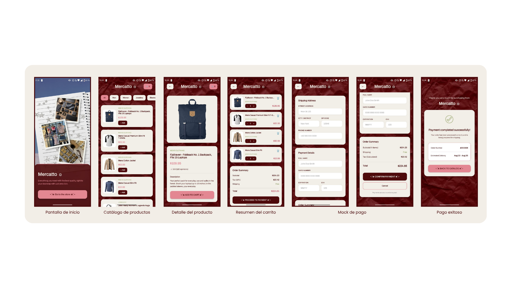

# Mercatto ☼ - Minidesk dev Mobile Challenge

---

Este proyecto es realizado con la finalidad de demostrar mis conocimientos técnicos para la vacante de Full Stack Developer en la empresa Minidesk dev.

Es un App de tienda; la cual llamé Mercatto para fines de diseño, que cuenta con un flujo de carrito completo, construida con **React Native + Expo + TypeScript** y consume la API: [Fake Store API](https://fakestoreapi.com).

---

## ¿Cómo instalar y correr el proyecto?

```bash
git clone https://github.com/GiovanaTSW/minidesk-mobile-challenge.git
cd minidesk-mobile-challenge
npm install
npx expo start
```

Escanea el QR con Expo Go (Android/iOS) o presiona `a` / `i` en la terminal para abrir un emulador. No requiere variables de entorno: la app consume directamente `https://fakestoreapi.com`, sin backend propio.

---

## Versiones de herramientas

| Herramienta | Versión |
|---|---|
| Node | v24.11.0 |
| Expo SDK | 54.0.36 |
| Expo Router | 6.0.24 |
| React Native | 0.81.5 |
| React | 19.1.0 |
| TypeScript | 5.9.2 |

---

## Organización de la estructura del proyecto

```
app/                                  # Rutas (Expo Router). Solo composición: leer
│                                     # params, llamar hooks, renderizar componentes.
├── _layout.tsx                       # Root layout: QueryClientProvider + Stack raíz
├── index.tsx                         # "/"  - Bienvenida
└── (shop)/                           # Grupo de ruta — no aparece en la URL
    ├── _layout.tsx                   # Stack del flujo de tienda
    ├── index.tsx                     # "/"                       Catálogo (listado)
    ├── product/
    │   └── [id].tsx                  # "/product/:id"          Detalle (ruta dinámica)
    ├── cart.tsx                      # "/cart"                 Resumen del carrito
    ├── checkout.tsx                  # "/checkout"             Pago mock
    └── success.tsx                   # "/success"              Confirmación de pago

src/
├── services/                         # Capa de datos. Única frontera con Fake Store API.
│   ├── api.ts                        # Cliente HTTP: getProducts(), getProductById(id)
│   └── mockProduct.ts                # Catálogo de respaldo cuando la API falla
├── store/
│   └── useCartStore.ts               # Zustand: fuente de verdad única del carrito
├── hooks/                            # Capa de aplicación: orquesta datos + estado
│   ├── useProduct.ts                 # React Query sobre services/api.ts (listado y detalle)
│   ├── useCartItem.ts                # Cantidad + acciones de un producto puntual
│   └── useCartTotals.ts              # Subtotal, impuesto y total (memoizado)
├── components/                       # Presentación. Sin lógica de negocio propia.
│   ├── ProductListItem.tsx           # Fila del catálogo (memoizada)
│   ├── CartListItem.tsx              # Fila del carrito (memoizada)
│   ├── QuantityStepper.tsx           # Control +/- reutilizable
│   └── OfflineBanner.tsx             # Aviso cuando la API falla
└── types/
    └── product.ts                    # Contratos de datos: Product, CartItem

docs/
├── ADR01_decisiones-tecnicas.md      # Justificación técnica de cada decisión (sección 4)
└── evidence/                         # Capturas del flujo completo
    ├── pantalla_inicio.jpeg
    ├── catalogo_producto_listado+-.jpeg
    ├── detalle_producto.jpeg
    ├── resumen_carrito.jpeg
    ├── checkout_mock_1.jpeg
    ├── checkout_mock_2.jpeg
    └── confirmacion_pago.jpeg

``` 

### Justificación de la organización de carpetas

La arquitectura del proyecto se organiza por capas, separando con claridad quién es responsable de qué. Esta decisión no busca complejidad: es un patrón conocido y probado, y usarlo evita reinventar una solución propia para un problema ya resuelto, lo que hubiera significado más tiempo de desarrollo sin ningún beneficio adicional para el alcance de esta prueba.

La separación de responsabilidades queda distribuida en tres capas:

- **Capa de servicios** (`src/services/`): es la única parte del proyecto que se comunica con la Fake Store API. Ninguna pantalla ni componente hace peticiones HTTP por su cuenta — todas pasan por aquí. Esto centraliza el manejo de errores en un solo lugar y evita que la lógica de red quede dispersa por el proyecto.

- **Capa de estado** (`src/store/`, junto con `src/hooks/`): contiene las reglas de negocio del carrito — sumar, restar, vaciar, calcular totales. Esta capa es la fuente de verdad de qué hay en el carrito y cuánto cuesta, independientemente de qué pantalla esté visible en ese momento.

- **Capa de vistas** (`app/`): se limita a pintar la interfaz y reaccionar a los cambios de estado. Ningún archivo dentro de `app/` calcula un total ni llama directamente a la API; solo toma lo que le devuelven los hooks y lo muestra. Esto significa que si mañana cambia la fórmula del total o el endpoint del catálogo, el ajuste se hace en un solo archivo, no en cada una de las cinco pantallas que lo usan.

Esta separación también responde a un requisito explícito de la prueba: la Fake Store API puede fallar de forma intermitente. Al mantener toda la comunicación con la API concentrada en la capa de servicios, es posible diseñar ahí el manejo de errores de forma resiliente — con un catálogo de respaldo y un aviso visual — sin que una falla de red rompa la aplicación ni obligue a duplicar esa lógica en cada pantalla.

Por último, el grupo de ruta `(shop)` agrupa las pantallas del flujo de tienda bajo su propio stack de navegación, separándolas de la pantalla de bienvenida, sin que esto afecte la URL final de cada ruta.

---

## Decisiones técnicas

Todas las justificaciones pedidas en la sección 4 del enunciado (estado global, navegación, cache, custom hooks, capa de datos, calidad general), además de las decisiones tomadas frente a requerimientos ambiguos, están documentadas en:

**→ [`docs/ADR01_decisiones-tecnicas.md`](./docs/ADR01_decisiones-tecnicas.md)** ✮˚.⋆

---

## ¿Qué dejaste afuera y qué harías con más tiempo?

**Fuera de alcance (decisión consciente):**
- Sin persistencia del carrito entre sesiones (AsyncStorage) — el carrito vive en memoria mientras la app está abierta. El enunciado excluye persistencia en servidor, y no alcanzó el tiempo para agregar persistencia local.
- Tallas, colores y favoritos que aparecen en las capturas de referencia del enunciado no se implementaron — están explícitamente marcados como fuera de los requerimientos funcionales.

**Con más tiempo:**
- Persistir el carrito con `zustand/middleware` (`persist` + AsyncStorage) para que sobreviva a un cierre de la app.
- Tests unitarios para `useCartStore` y `useCartTotals` — son lógica de negocio pura, fáciles de testear sin depender de la UI.
- Migrar el carrito de `items: CartItem[]` a un `Record<number, CartItem>` indexado por id — con 20 productos el costo de recorrer el array es imperceptible, pero si el catálogo creciera esta sería la optimización natural (ver detalle en `docs/ADR01-decisiones-tecnicas.md`).
- Guard de navegación en `/success` para bloquear el acceso directo sin checkout confirmado.
- Skeleton loaders en el catálogo en vez de un `ActivityIndicator` genérico.

---

## Evidencias del proyecto

Para evidencias del proyecto así es cómo se ven todas las vistas; sin embargo, para mejor visualización recomiendo observar las capturas y el video del flujo completo en ⋆.˚✮ [`docs/evidence/`](./docs/evidence). ✮˚.⋆

